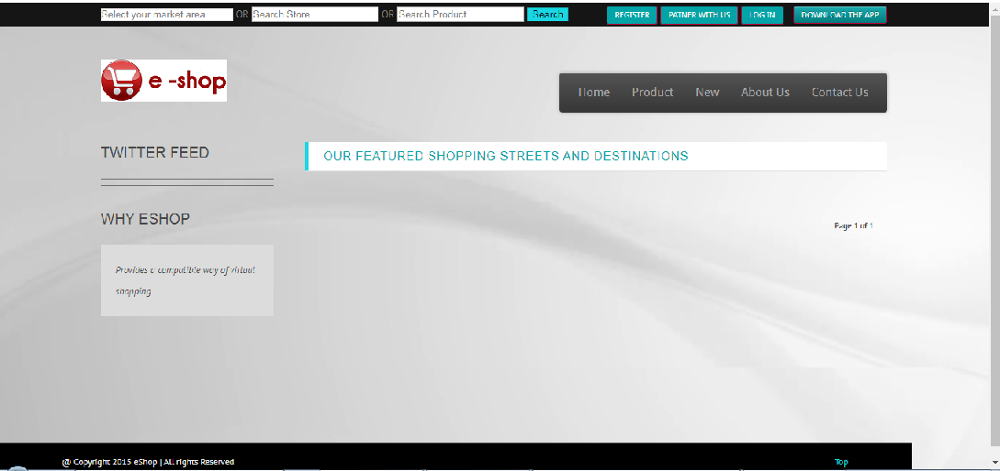

# eShop
Shopping site for local store.

---------------------------------------------------------------------------------

### Installing App (Install Python 2.7)

```bash
pip install virtualenvwrapper-win
mkvirtualenv eShop
pip install Django==1.3
python manage.py syncdb
python manage.py runserver
```


